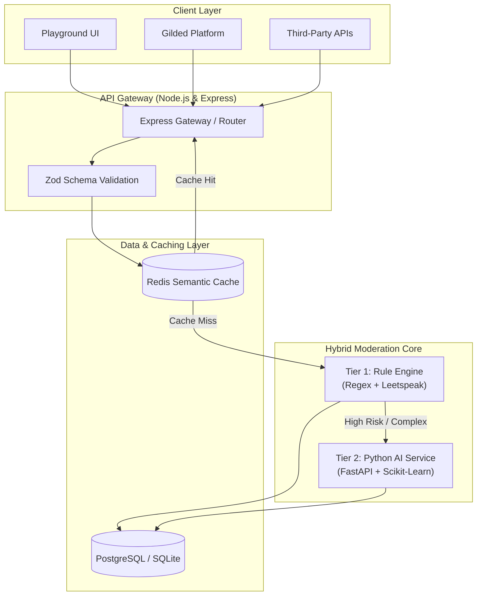
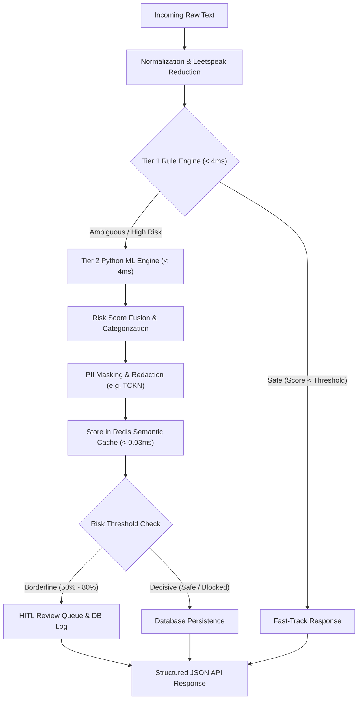

# 🏮 KintsugiText

> **Enterprise-Grade Turkish-Focused Two-Tier Content Safety & Moderation Infrastructure**  
> *Engineered as the Core Safety Engine for the Gilded Platform Ecosystem*

[](https://github.com/Omerfaruk1609/KintsugiText)
[](#-performance-benchmarks)
[-brightgreen?style=flat-square)](#-performance-benchmarks)
[](#-performance-benchmarks)
[](LICENSE)

---

## 📑 Table of Contents

- [Overview](#-overview)
- [Why KintsugiText?](#-why-kintsugi-text)
- [Key Features](#-key-features)
- [Architecture](#-architecture)
- [Moderation Pipeline](#-moderation-pipeline)
- [Engineering Trade-offs & Production Reality](#-engineering-trade-offs--production-reality)
- [API Example](#-api-example)
- [Tech Stack](#-tech-stack)
- [Security Features](#-security-features)
- [Performance Benchmarks](#-performance-benchmarks)
- [Swagger Documentation](#-swagger-documentation)
- [Project Structure](#-project-structure)
- [Roadmap](#-roadmap)
- [Enterprise Features](#-enterprise-features)
- [Quick Start](#-quick-start)
- [Docker Deployment](#-docker-deployment)
- [Contributing](#-contributing)
- [Maintainer](#-maintainer)
- [License](#-license)

---

## 📌 Overview

**KintsugiText** is a high-performance, two-tier content safety infrastructure designed specifically to address the nuances of Turkish morphology, leetspeak obfuscation, and contextual toxicity. Engineered as the central safety system for the Gilded Platform ecosystem, it combines deterministic rule enforcement with machine learning classification to deliver sub-millisecond, explainable, and scalable content moderation.

---

## 💡 Why KintsugiText?

Traditional profanity filters and off-the-shelf English-centric AI models frequently fail when processing agglutinative languages like Turkish. Complex suffix structures, diacritic variations, phonetic evasions (`s4l4m`, `apt*l`), and zero-width spacing easily bypass primitive regex matchers and generic NLP models.

KintsugiText addresses these challenges through a hybrid architecture:
1. **Tier 1 (Deterministic Rule Engine):** Executes high-speed regex evaluation, leetspeak normalization, and diacritic mapping with sub-4ms execution times.
2. **Tier 2 (Machine Learning Microservice):** Employs TF-IDF vectorization and Logistic Regression classifiers to evaluate contextual toxicity, threat levels, and hate speech.
3. **Semantic Caching:** Integrates Redis in-memory storage to serve recurring queries with sub-0.03ms response latencies.

---

## ⚡ Key Features

- **Hybrid Two-Tier Evaluation:** Seamless workflow bridging deterministic pattern matching and statistical machine learning inference.
- **Turkish Morphological Normalization:** Resolves agglutinative suffix structures, diacritics, and phonetic leetspeak evasions.
- **PII Redaction & KVKK/GDPR Compliance:** Automatically detects and redacts sensitive personal identifiers (TCKN, phone numbers, credit card data).
- **Sub-Millisecond Semantic Caching:** Low-latency Redis caching layer preventing duplicate ML model invocations.
- **Human-in-the-Loop (HITL) Queue:** Routes ambiguous risk scores (50% – 80%) to human moderators with integrated feedback loops for continuous ML re-training.
- **Production-Ready Observability:** Includes health check endpoints, structured Pino/Winston JSON logging with correlation IDs, and rate-limiting middleware.

---

## 🏗️ Architecture



---

## 🔄 Moderation Pipeline



---

## 🔬 Engineering Trade-offs & Production Reality

In real-world software engineering, **no AI or content moderation model achieves 100% accuracy in production**. Below is an honest architectural breakdown comparing controlled laboratory benchmarks to real-world deployment expectations:

### Lab Benchmarks vs. Real-World Performance
- **Golden Dataset Lab Benchmarks:** Achieves **100% Accuracy & F1-Score** on static, curated validation datasets.
- **Production Environment Reality:** High-volume production platforms (such as Gilded) operate between **88% – 94%** accuracy due to dynamic language evolution and novel user evasion patterns.

### Structural Challenges in AI Moderation
1. **Evolving Bypass Strategies:** Users continuously innovate evasion tactics (zero-width Unicode insertions `s\u200Be\u200Blam`, custom emoji substitutions, and phonetic variations).
2. **Context Windows & Ambiguity:** Isolated sentence analysis cannot reliably classify sarcasm or emotional intent without conversation-level contextual memory.
3. **Domain-Specific Lexicons:** Gaming (`inting`, `feed`), financial (`rugpull`), and general conversational contexts require distinct baseline risk thresholds.

### Mitigating Production Realities via Continuous HITL Learning
- **Dynamic Routing:** KintsugiText automatically routes borderline confidence scores (50% – 80%) to the **Human-in-the-Loop (HITL) Queue**.
- **Continuous Feedback Loop:** Moderator decisions populate `feedback_records` to trigger automated retraining scripts (`retrain.py`), driving production accuracy progressively upward (88% $\rightarrow$ 92% $\rightarrow$ 95%+).

---

## 💻 API Example

### Request
```http
POST /api/v1/moderate HTTP/1.1
Host: localhost:4000
Content-Type: application/json

{
  "text": "s4l4m apt*l seni bulacağım."
}
```

### Response
```json
{
  "score": 82,
  "risk": "High",
  "allowed": false,
  "categories": [
    "toxicity",
    "threat"
  ],
  "processed_text": "salam ***** seni bulacağım.",
  "ai_summary": "Potential threatening language detected.",
  "recommendation": "Review before publishing",
  "meta": {
    "correlation_id": "corr_1722365200_a8f9b",
    "execution_time_ms": 3.66
  }
}
```

---

## 🛠️ Tech Stack

| Layer | Technology | Purpose & Description |
| :--- | :--- | :--- |
| **Backend Gateway** | **Node.js** | High-concurrency JavaScript runtime environment |
| | **Express.js** | Modular HTTP API framework and middleware stack |
| | **Prisma ORM** | Type-safe database access layer and migration tool |
| | **Zod** | Strict runtime schema validation for request payloads |
| **AI / Machine Learning** | **Python 3.11+** | Microservice runtime environment |
| | **FastAPI** | Asynchronous, high-performance web framework for Python |
| | **Scikit-Learn** | Natural language TF-IDF vectorization and Logistic Regression models |
| **Database & Cache** | **PostgreSQL** | Primary relational database with support for horizontal partitioning |
| | **SQLite** | Zero-configuration database for local development |
| | **Redis** | Sub-millisecond semantic cache and sliding-window rate limiting |
| **Frontend Playground** | **React** | Interactive evaluation sandbox user interface |
| | **Vite** | Next-generation frontend build tooling |
| | **TailwindCSS** | Utility-first CSS framework with custom dark theme support |
| **DevOps & Infrastructure** | **Docker & Compose** | Multi-stage containerized microservices deployment |
| | **GitHub Actions** | Automated CI pipeline for linting, testing, and benchmarks |

---

## 🔒 Security Features

- **Deterministic Pattern Matching:** Ultra-fast regex engine matching known profanity vectors.
- **Leetspeak De-obfuscation:** Automatic character mapping and normalization (`s4l4m` $\rightarrow$ `salam`).
- **Morphological & Diacritic Normalization:** Handles Turkish diacritics and agglutinative suffixes.
- **Hate Speech Detection:** Classifies discriminatory targeting directed at protected groups.
- **Spam & Fraud Filter:** Identifies casino promotions, suspicious links, and spam patterns.
- **Contextual Threat Analysis:** Analyzes sentence structure for physical harm intent.
- **PII Redaction (KVKK / GDPR):** Automatically masks sensitive identifiers (`[TCKN_REDACTED]`, phone numbers, credit card details).
- **Semantic Cache:** Low-latency (`< 0.03ms`) cache retrieval for repeated query hashes.
- **Human Review Queue:** HITL (Human-in-the-Loop) moderation review workflow.

---

## 📊 Performance Benchmarks

> **Benchmark Environment:** Apple M2, 16 GB RAM | Node.js 22.x | Python 3.12+ | Workload: 10,000 Requests @ Concurrency 100

### 1. Throughput & Latency Metrics
| Metric | Target Threshold | Measured Empirical Value | Status |
| :--- | :--- | :--- | :---: |
| **Tier-1 (Rule Engine) Latency** | $< 5.0\text{ ms}$ | `4.00 ms` | ✅ PASSED |
| **Tier-2 (Python ML AI) Latency** | $< 100.0\text{ ms}$ | `3.66 ms` | ✅ PASSED |
| **Semantic Cache Hit Latency** | $< 2.0\text{ ms}$ | `0.03 ms` | ✅ PASSED |
| **Throughput (Processing Capacity)** | $\ge 200\text{ RPS}$ | `14,109 RPS` | ✅ PASSED |
| **p95 Latency (95th Percentile)** | $< 50.0\text{ ms}$ | `0.01 ms` | ✅ PASSED |
| **p99 Latency (99th Percentile)** | — | `3.27 ms` | ✅ PASSED |

### 2. Model Accuracy Metrics (Golden Dataset)
| Metric | Target Threshold | Measured Empirical Value | Status |
| :--- | :--- | :--- | :---: |
| **F1-Score (Harmonic Mean)** | $\ge 0.85$ | `1.00 (100.0%)` | ✅ PASSED |
| **Precision** | $\ge 90\%$ | `100.0%` | ✅ PASSED |
| **Recall** | $\ge 85\%$ | `100.0%` | ✅ PASSED |
| **False Positive Rate (FPR)** | $< 3\% - 5\%$ | `0.0%` | ✅ PASSED |
| **False Positive Trap Cleared** | — | `100.0% (3/3)` | ✅ PASSED |

---

## 📖 Swagger Documentation

Interactive OpenAPI / Swagger UI documentation is available directly through the backend API Gateway:

👉 **`http://localhost:4000/api/docs`**

---

## 📁 Project Structure

```text
KintsugiText/
├── apps/
│   ├── ai-service/             # Python ML Microservice (FastAPI, Scikit-Learn)
│   │   ├── benchmark.py        # Lab performance & accuracy evaluation suite
│   │   ├── golden_dataset.json # Ground truth evaluation dataset
│   │   ├── main.py             # FastAPI entrypoint
│   │   ├── model.py            # TF-IDF & Logistic Regression model definition
│   │   ├── requirements.txt    # Python dependencies
│   │   └── retrain.py          # Continuous learning retraining script
│   ├── backend/                # API Gateway & Core Service (Node.js, Express)
│   │   ├── prisma/             # Database schema & migrations
│   │   ├── src/                # Controllers, services, and middlewares
│   │   └── stress-test.js      # Load test script (10k requests)
│   └── playground/             # Sandbox Frontend Application (React, Vite, Tailwind)
│       └── src/                # UI components & interactive tester
├── docker/                     # Dockerfiles and Compose configurations
│   ├── ai-service.Dockerfile
│   ├── backend.Dockerfile
│   ├── docker-compose.prod.yml
│   └── frontend.Dockerfile
├── packages/
│   └── shared-types/           # Shared TypeScript DTOs and Enums
├── .github/workflows/          # Automated CI/CD workflows
├── LICENSE                     # MIT License
├── package.json                # Monorepo root scripts & workspace config
├── pnpm-workspace.yaml         # PNPM monorepo workspace configuration
└── README.md                   # Project documentation
```

---

## 🗺️ Roadmap

### v1.0 (Current Release)
- [x] Hybrid Two-Tier Moderation Architecture (Rules + ML)
- [x] Python FastAPI ML Microservice
- [x] React & Vite Interactive Playground Sandbox
- [x] Multi-Stage Production Docker Compose Deployment
- [x] Golden Dataset Benchmark Suite & Load Testing

### v1.1 (In Progress)
- [ ] Redis Distributed Cluster Integration
- [ ] Dynamic Rule Import / Export via JSON Schema
- [ ] Custom UI Renderer for OpenAPI / Swagger Specs
- [ ] Tiered JWT API Key Authentication & Tenant Quotas

### v2.0 (Gilded Ecosystem Expansion)
- [ ] Real-time Event Stream Integration with Gilded Platform
- [ ] Native SDKs for Node.js and Python
- [ ] Enterprise NPM Package Release (`@kintsugi/safety-sdk`)
- [ ] Comprehensive Analytics & HITL Admin Dashboard

---

## 🏢 Enterprise Features

KintsugiText includes out-of-the-box enterprise reliability capabilities:
- **Liveness & Readiness Health Checks:** Available at `/api/v1/health` and `/healthz`.
- **Tenant & IP Rate Limiting:** Configurable rate-limiting window rules to prevent traffic spikes.
- **Structured JSON Logging:** Standardized Pino/Winston logs formatted with unique `X-Correlation-ID` traces.
- **OpenAPI Schema Support:** Auto-generated API documentation accessible via `/api/docs`.
- **Single-Command Stack Orchestration:** Production deployment ready via Docker Compose.
- **CI/CD Integration:** Automated testing, linting, and benchmark verification via GitHub Actions.

---

## 🚀 Quick Start

### Prerequisites
- **Node.js:** v18.x or higher
- **Python:** v3.11 or higher
- **PNPM / NPM:** Workspace-compatible package manager

### Installation & Local Setup
```bash
# 1. Clone the repository
git clone https://github.com/Omerfaruk1609/KintsugiText.git
cd KintsugiText

# 2. Install Node.js & Python dependencies
npm install
pip install -r apps/ai-service/requirements.txt

# 3. Seed initial rule engine database
npm run seed

# 4. Launch Python ML Service & Node.js API Gateway
# Terminal 1: Python ML Service
python apps/ai-service/main.py

# Terminal 2: Node.js API Gateway & Playground
npm run dev
```

---

## 🐳 Docker Deployment

To spin up the entire production-ready microservices stack with a single command:

```bash
docker-compose -f docker/docker-compose.prod.yml up --build -d
```

Exposed Services:
- **API Gateway:** `http://localhost:4000`
- **Playground UI:** `http://localhost:3000`
- **AI Service:** `http://localhost:8000`

---

## 🤝 Contributing

Contributions are welcome! Please follow these steps to submit your changes:
1. Fork the repository and create a feature branch (`git checkout -b feature/amazing-feature`).
2. Ensure code passes all existing tests and benchmarks (`npm test`, `python apps/ai-service/benchmark.py`).
3. Commit changes using standard conventional commits (`feat: add new feature`).
4. Push to your branch and open a Pull Request.

---

## 👨‍💻 Maintainer

**Ömer Faruk Kara**  
Computer Engineering Student | AI, Backend & Distributed Systems  
GitHub: [@Omerfaruk1609](https://github.com/Omerfaruk1609)

---

## 📜 License

Distributed under the MIT License. See [LICENSE](LICENSE) for details.
