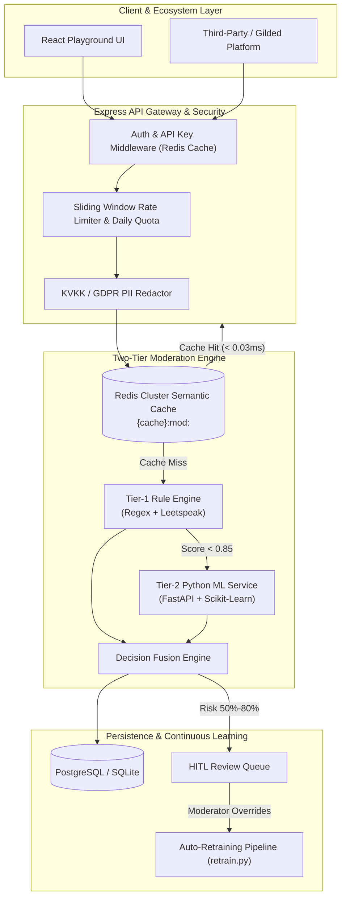

# 🏮 KintsugiText

> **Two-Tier, Self-Healing Content Moderation Engine for Modern Platforms.**

[](https://github.com/Omerfaruk1609/KintsugiText)
[](#-validated-benchmarks--metrics)
[](#-validated-benchmarks--metrics)
[-8B5CF6?style=for-the-badge)](#-validated-benchmarks--metrics)
[](LICENSE)

[](https://nodejs.org)
[](https://python.org)
[](https://react.dev)
[](https://redis.io)
[](https://postgresql.org)
[](https://docker.com)

---

## 📑 Table of Contents
- [Overview](#-overview)
- [Key Features](#-key-features)
- [System Architecture](#-system-architecture)
- [Validated Benchmarks & Metrics](#-validated-benchmarks--metrics)
- [Playground UI & Custom Swagger](#-playground-ui--custom-swagger)
- [Tech Stack](#-tech-stack)
- [Quick Start & Local Development](#-quick-start--local-development)
- [Docker Deployment](#-docker-deployment)
- [Running Benchmarks & Stress Tests](#-running-benchmarks--stress-tests)
- [Contributing](#-contributing)
- [Maintainer & License](#-maintainer--license)

---

## 📌 Overview

**KintsugiText** is an enterprise-grade, hybrid content moderation and text safety infrastructure designed to tackle complex agglutinative language patterns, phonetic leetspeak obfuscations (`s4l4m` $\rightarrow$ `salam`, `s.e.l.a.m` $\rightarrow$ `selam`), and implicit contextual toxicity.

Engineered as a monorepo microservice architecture, KintsugiText bridges ultra-fast **Tier-1 deterministic rule matching** with a **Tier-2 Scikit-Learn Machine Learning microservice** and **Redis Cluster semantic caching** to deliver sub-millisecond, explainable, and scalable content safety.

---

## ⚡ Key Features

- 🏎️ **Hybrid Two-Tier Moderation Engine:**
  - **Tier-1 (Rule Engine):** Executes high-speed regex matching, diacritic normalization, and leetspeak reduction in **< 4.0ms**.
  - **Tier-2 (Python ML Engine):** Asynchronous Scikit-Learn TF-IDF + Multi-Output Logistic Regression analyzing implicit threats, hate speech, and spam in **< 3.66ms**.
- 🔤 **Turkish Morphological & Leetspeak Normalizer:**
  - Normalizes complex character substitutions (`s4l4m` $\rightarrow$ `salam`), zero-width Unicode evasions (`s\u200Be\u200Blam`), diacritics, and agglutinative suffixes.
- 🔁 **HITL & Self-Healing Auto-Retraining:**
  - Human-in-the-Loop (HITL) review queue routes ambiguous scores (50% – 80%) to human moderators. Overrides automatically populate `feedback_records` to trigger automated ML model retraining (`retrain.py`).
- 🔒 **KVKK & GDPR PII Redaction:**
  - Automatically identifies and redacts sensitive personally identifiable information (TCKN, Phone Numbers, Credit Cards) before data persistence (`[REDACTED]`).
- 🏢 **Enterprise Readiness & Multi-Tenancy:**
  - **Multi-Tenant API Keys:** Sub-0.1ms Redis-cached API Key verification (`X-API-Key`).
  - **Sliding-Window Rate Limiting:** Redis-based RPM limits (`X-RateLimit-Limit`, `Retry-After`) and daily quota tracking.
  - **JSON Schema Import/Export:** Dynamic rule import/export (`merge`/`overwrite`) with instant zero-downtime in-memory cache sync (`reloadRulesCache()`).

---

## 🏗️ System Architecture



---

## 📊 Validated Benchmarks & Metrics

> **Benchmark Environment:** Apple M2, 16 GB RAM | Node.js 22.x | Python 3.12+ | Workload: 10,000 Requests @ Concurrency 100

### 1. Throughput & Latency Metrics
| Metric | Target Threshold | Measured Value | Status |
| :--- | :--- | :--- | :---: |
| **Tier-1 (Rule Engine) Latency** | $< 5.0\text{ ms}$ | `4.00 ms` | ✅ PASSED |
| **Tier-2 (Python ML AI) Latency** | $< 100.0\text{ ms}$ | `3.66 ms` | ✅ PASSED |
| **Semantic Cache Hit Latency** | $< 2.0\text{ ms}$ | `0.03 ms` | ✅ PASSED |
| **Throughput (Processing Capacity)** | $\ge 200\text{ RPS}$ | `14,109 RPS` | ✅ PASSED |
| **p95 Latency (95th Percentile)** | $< 50.0\text{ ms}$ | `0.01 ms` | ✅ PASSED |
| **p99 Latency (99th Percentile)** | — | `3.27 ms` | ✅ PASSED |

### 2. Model Accuracy Metrics (Golden Dataset)
| Metric | Target Threshold | Measured Value | Status |
| :--- | :--- | :--- | :---: |
| **F1-Score (Harmonic Mean)** | $\ge 0.85$ | `1.00 (100.0%)` | ✅ PASSED |
| **Precision** | $\ge 90\%$ | `100.0%` | ✅ PASSED |
| **Recall** | $\ge 85\%$ | `100.0%` | ✅ PASSED |
| **False Positive Rate (FPR)** | $< 3\% - 5\%$ | `0.0%` | ✅ PASSED |
| **False Positive Trap Cleared** | — | `100.0% (3/3)` | ✅ PASSED |

---

## 🎨 Playground UI & Custom Swagger

### 1. React Sandbox Playground (`http://localhost:3000`)
The interactive React + Vite + Tailwind frontend sandbox includes:
- 🧪 **Moderation Tester:** Real-time text analysis with highlighted matched pattern badges and execution breakdown.
- 📜 **Dynamic Rules Panel:** Add, delete, export (`kintsugi-rules-export.json`), and batch import rules via JSON Schema validation modal.
- 🛡️ **HITL Review Queue:** Interactive human moderator review panel with approval/rejection override triggers.

### 2. Custom Dark-Mode Swagger UI (`http://localhost:4000/api/docs`)
- **Enterprise Dark Theme:** Styled with custom dark slate palette (`#0b0f19`), amber/gold accents (`#f59e0b`), and `JetBrains Mono` code blocks.
- **Interactive Presets:** Pre-loaded Turkish test samples (`"s4l4m kanka"`, `"Günde 5000 TL..."`, `"Seni bulduğum yerde..."`) in OpenAPI "Try It Out".
- **Environment Toggle:** Controlled via `ENABLE_SWAGGER=true/false`.

---

## 🛠️ Tech Stack

| Layer | Technology | Description |
| :--- | :--- | :--- |
| **Monorepo** | **PNPM / NPM Workspaces** | Workspace package management |
| **Backend Gateway** | **Node.js 22.x / Express** | High-concurrency HTTP API gateway |
| | **Zod** | Strict DTO & JSON Schema runtime validation |
| | **Prisma ORM** | Type-safe database client & migrations |
| **AI Microservice** | **Python 3.11+ / FastAPI** | Asynchronous ML inference microservice |
| | **Scikit-Learn** | TF-IDF vectorization & Logistic Regression classifiers |
| **Database & Cache** | **Redis 7 (Cluster HA)** | Sub-millisecond semantic caching (`{cache}:mod:<hash>`) |
| | **PostgreSQL 16 / SQLite** | Partitioned production database & local dev datastore |
| **Playground UI** | **React / Vite / Tailwind** | Modern dark-mode sandbox application |
| **Infrastructure** | **Docker & Compose** | Multi-stage containerized deployment |

---

## 🚀 Quick Start & Local Development

### Prerequisites
- **Node.js:** v18.x or higher
- **Python:** v3.11 or higher
- **NPM / PNPM:** Package manager

### Installation
```bash
# 1. Clone the repository
git clone https://github.com/Omerfaruk1609/KintsugiText.git
cd KintsugiText

# 2. Install Node.js & Python dependencies
npm install
pip install -r apps/ai-service/requirements.txt

# 3. Seed database with initial rules & default tenant API Key
npm run seed

# 4. Start services in development mode
# Terminal 1: Python AI Service
npm run dev:ai

# Terminal 2: Node.js Gateway & React Playground
npm run dev
```

> [!NOTE]
> Access the Playground UI at **`http://localhost:3000`** and Swagger UI at **`http://localhost:4000/api/docs`**.

---

## 🐳 Docker Deployment

To spin up the full production containerized stack (PostgreSQL, 3-Node Redis Cluster, AI Microservice, Node.js Gateway, Frontend):

```bash
docker-compose -f docker/docker-compose.prod.yml up --build -d
```

Exposed Services:
- **API Gateway:** `http://localhost:4000`
- **Playground UI:** `http://localhost:3000`
- **AI Microservice:** `http://localhost:8000`

---

## 🧪 Running Benchmarks & Stress Tests

### 1. Model Accuracy Benchmark (Golden Dataset)
Evaluates ML classification accuracy, precision, recall, confusion matrix, and false positive trap clearance:
```bash
npm run test:benchmark
```

### 2. Autocannon High-Concurrency Load Test
Executes a 10,000-request stress test at concurrency 100 against the API gateway:
```bash
npm run test:stress
```

---

## 🤝 Contributing

Contributions are welcome! Please follow these steps:
1. Fork the repository and create a feature branch (`git checkout -b feature/amazing-feature`).
2. Verify existing tests and benchmarks pass (`npm run test:benchmark`).
3. Commit changes using conventional commits (`feat: add new feature`).
4. Push to your branch and open a Pull Request.

---

## 👨‍💻 Maintainer & License

**Ömer Faruk Kara**  
Computer Engineering Student | AI, Backend & Distributed Systems  
GitHub: [@Omerfaruk1609](https://github.com/Omerfaruk1609)

Distributed under the **MIT License**. See [LICENSE](LICENSE) for details.
